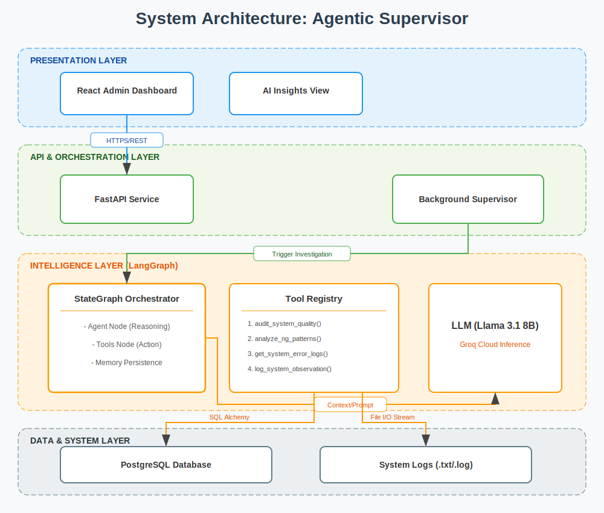

# Agentic Supervisor Architecture

This document describes the stateful orchestration of the AI Supervisor using LangGraph.

## StateGraph Visualization

## Logic Breakdown

### 1. The 'agent' Node
The LLM (Llama 3.1 8B) is invoked with the current `AgentState` (message history). It decides if the current task can be answered directly or if it needs to query the system using a tool.

### 2. The 'tools' Node (Manual Dispatcher)
This is the **Security Firewall**. The LLM never touches the database directly. It sends a "Tool Call" request. Our dispatcher:
1.  Receives the request.
2.  Maps the request name to a Python function in `tools.py`.
3.  Injects the **Active Database Session**.
4.  Returns the raw data to the Agent.

### 3. Conditional Edge: `should_continue`
A simple logic gate:
*   If the LLM's last response contains `tool_calls`, go to the `tools` node.
*   If the LLM has finished its investigation and provided a summary, go to `END`.

### 4. Background Loop
The `autonomous_supervisor_loop` in `main.py` runs as an asynchronous task. It ensures that even if no human is logged in, the agent is performing "System Audits" every hour and logging `SystemObservations` to the database.
