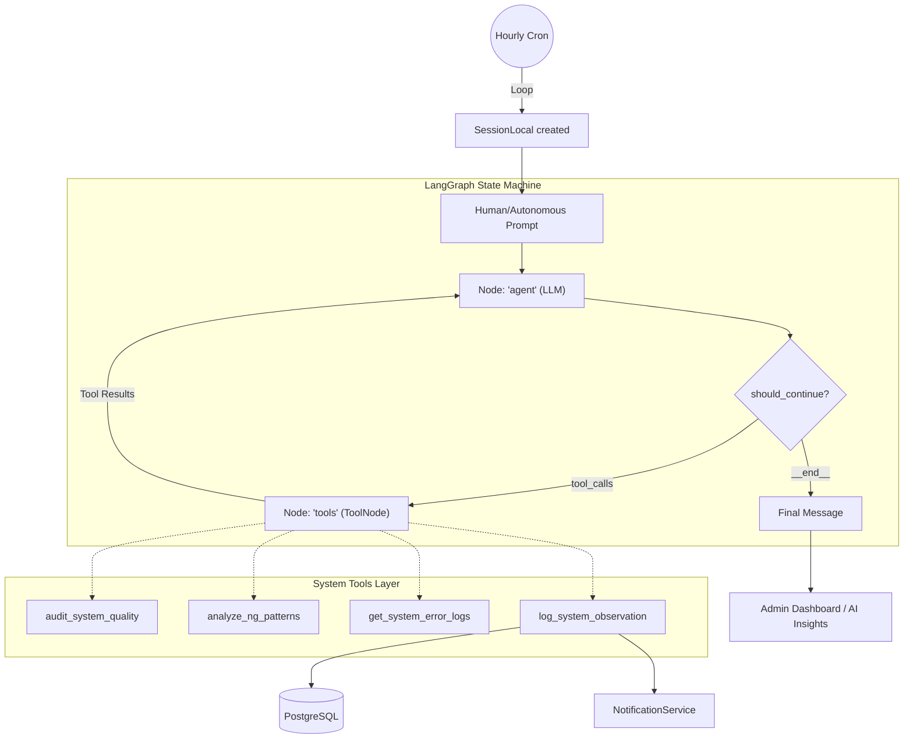

# Agentic Supervisor Architecture

This document describes the stateful orchestration of the AI Supervisor using LangGraph.

## StateGraph Visualization

## Logic Breakdown

### 1. The 'agent' Node
The LLM (Llama 3.3 70B) is invoked with the current `AgentState` (message history) and a **Strengthened System Prompt**. It decides if the current task can be answered directly or if it needs to query the system using a tool.

### 2. The 'tools' Node (ToolNode)
We use LangGraph's prebuilt `ToolNode`. This replaces the manual dispatcher and provides:
1.  **Standardized Execution**: Automatically handles tool call mapping.
2.  **Context Injection**: Tools receive the `RunnableConfig`, allowing them to safely access the **Active Database Session**.
3.  **Error Resilience**: Tool execution errors are captured and returned to the LLM as `ToolMessage` results, allowing the agent to reason about failures.

### 3. Conditional Edge: `should_continue`
A logic gate that checks for `tool_calls` in the last message. If present, it routes to the `tools` node; otherwise, it ends the turn.

### 4. Background Loop (Circuit Breaker)
The `autonomous_supervisor_loop` in `main.py` runs as an asynchronous task. 
*   **Checklist Prompt**: Uses a structured prompt to ensure a full system audit is performed.
*   **Circuit Breaker**: If the loop encounters 3 consecutive failures (e.g., API downtime or DB connection issues), it automatically disables itself to prevent runaway logs.
